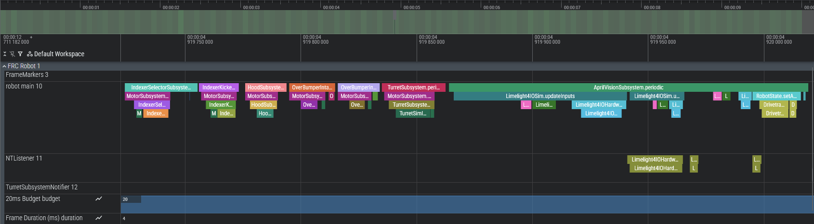
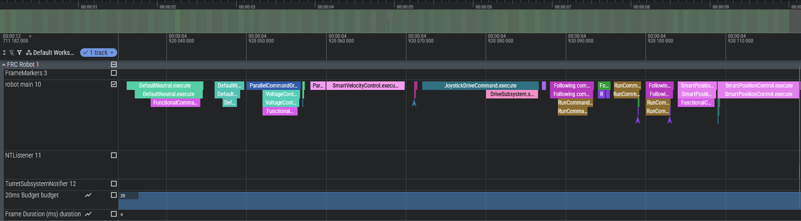

# AEMTracer

A lightweight, high-performance tracing library for FRC robots. Generate timeline visualizations of your robot code execution with minimal overhead.

[](https://github.com/WL-Richards/AEMTracer/actions/workflows/ci.yml)

[Documentation](https://wl-richards.github.io/AEMTracer/) | [API Reference](https://wl-richards.github.io/AEMTracer/javadoc/) | [Test Results](https://wl-richards.github.io/AEMTracer/tests/) | [Perfetto UI](https://ui.perfetto.dev)

## Features

- **Annotation-based tracing** - Just add `@Traced` to any method
- **Subsystem categories** - Group traces by subsystem (Drivetrain, Vision, etc.) for filtering in Perfetto
- **Command framework integration** - Auto-trace WPILib Command lifecycle methods
- **Zero-allocation design** - Pre-allocated circular buffer avoids GC pauses
- **Multi-thread support** - Automatically detects and separates Notifier threads
- **Loop overrun detection** - Highlights loops exceeding the 20ms budget
- **Perfetto-compatible output** - View traces in [Perfetto UI](https://ui.perfetto.dev) or Chrome's tracing viewer
- **Minimal overhead** - Designed for real-time robot control loops

## Concepts

### Loops

A **loop** represents one iteration of your robot's periodic function (`robotPeriodic()`). FRC robots typically run at 50Hz, so each loop is ~20ms. The tracer uses a circular buffer of 250 loops (~5 seconds of history).

You mark loop boundaries explicitly:

```java
public void robotPeriodic() {
    Tracer.beginLoop();   // Start of this loop iteration
    // ... robot code ...
    Tracer.endLoop();     // End of this loop iteration
}
```

### Spans

A **span** is a timed section of code within a loop. Each span captures:
- Start and end timestamps
- Method/section name
- Thread ID (to separate main thread from Notifier threads)
- Optional category (e.g., "Drivetrain", "Vision")

Multiple spans nest within each loop, creating a timeline of what executed during that iteration. Each loop supports up to **256 spans** with a maximum nesting depth of **32**.

```
Loop 0 ─┬─ DriveSubsystem.periodic()  [0.2ms]
        ├─ ShooterSubsystem.periodic() [0.5ms]
        │   └─ calculateTrajectory()   [0.3ms]
        └─ VisionSubsystem.periodic()  [1.1ms]

Loop 1 ─┬─ DriveSubsystem.periodic()  [0.2ms]
        └─ ...
```

## Installation

### Using JitPack (Recommended)

Add JitPack to your `build.gradle` repositories block (alongside existing repositories):

```gradle
repositories {
    mavenCentral()  // Required for ByteBuddy dependency
    maven { url 'https://jitpack.io' }
}
```

Then add the dependency:

```gradle
dependencies {
    implementation 'com.github.WL-Richards:AEMTracer:1.0.0'
}
```

> **Note for FRC projects**: Your `build.gradle` already has a `repositories` block with WPILib maven repos. Just add the two lines above to that existing block.

### Local Installation

1. Clone this repository
2. Run `./gradlew publishToMavenLocal`
3. Add to your project:

```gradle
repositories {
    mavenLocal()
}

dependencies {
    implementation 'com.aembot.lib:AEMTracer:1.0.0'
}
```

## Quick Start

### 1. Initialize the tracer in `Main.java`

```java
import com.aembot.lib.tracing.TracingBootstrap;

public final class Main {
    public static void main(String... args) {
        // Install BEFORE any @Traced classes are loaded
        TracingBootstrap.install();

        // Optional: Auto-trace all Command lifecycle methods
        TracingBootstrap.installCommandTracing();

        RobotBase.startRobot(Robot::new);
    }
}
```

### 2. Add loop boundaries in `Robot.java`

```java
import com.aembot.lib.tracing.Tracer;

@Override
public void robotPeriodic() {
    Tracer.beginLoop();

    // Your robot code here...

    Tracer.endLoop();
}
```

### 3. Annotate methods to trace

Adding `@Traced` to a method creates a span each time it's called:

```java
import com.aembot.lib.tracing.Traced;

@Traced
public void periodic() {
    updateInputs();
    runStateMachine();
    updateOutputs();
}

@Traced("CustomName")
private void updateInputs() {
    // Method body - timing is automatic
}

// Use categories to group spans by subsystem in Perfetto
@Traced(category = "Drivetrain")
public void drivetrainPeriodic() { ... }

@Traced(value = "ProcessTargets", category = "Vision")
private void processVisionTargets() { ... }
```

### 4. Export traces

```java
@Override
public void disabledInit() {
    // Export when robot is disabled
    Tracer.exportToJson("trace_" + System.currentTimeMillis() + ".json");
}
```

### 5. View in Perfetto

1. Open [Perfetto UI](https://ui.perfetto.dev)
2. Drag and drop your `trace_*.json` file
3. Explore the timeline!



## Manual Tracing (Alternative)

If you prefer not to use annotations, you can manually trace code blocks:

```java
// Basic tracing
try (var t = Tracer.trace("MyClass.myMethod")) {
    // Code to trace
}

// With category for filtering in Perfetto
try (var t = Tracer.trace("calculateTrajectory", "Shooter")) {
    // Code to trace - will appear under "Shooter" category
}
```

## Command Framework Integration

Enable automatic tracing of all WPILib Command lifecycle methods:

```java
// In Main.java, after TracingBootstrap.install()
TracingBootstrap.installCommandTracing();
```

This automatically traces `initialize()`, `execute()`, `isFinished()`, and `end()` on all Command subclasses. Traces appear under the "Command" category in Perfetto.

No changes to your Command classes are required - it works via bytecode instrumentation.



## Configuration

### Disable for Competition

```java
// In robotInit() or autonomousInit()
if (DriverStation.isFMSAttached()) {
    Tracer.setEnabled(false);
}
```

### Buffer Size

The default buffer holds 250 loops (~5 seconds at 50Hz) with up to 256 spans per loop. These values are configured in `Tracer.java` and `TraceLoop.java`.

## Output Format

Traces are exported in [Chrome Tracing JSON format](https://docs.google.com/document/d/1CvAClvFfyA5R-PhYUmn5OOQtYMH4h6I0nSsKchNAySU/preview), compatible with:

- [Perfetto UI](https://ui.perfetto.dev) (recommended)
- Chrome's built-in tracer (`chrome://tracing`)
- Custom visualization tools

### Track Layout

| Track | Description |
|-------|-------------|
| `Loop Duration (ms)` | Counter showing loop timing |
| `LoopOverruns` | Markers for loops exceeding 20ms |
| `LoopMarkers` | Loop boundary indicators |
| `robot main` | Main robot thread spans |
| `Notifier-*` | Notifier thread spans |

### Category Filtering

Use Perfetto's category filter to show/hide spans by subsystem:
- `robot` - Default category for uncategorized spans
- `Command` - Command lifecycle methods (if command tracing enabled)
- Custom categories (e.g., `Drivetrain`, `Vision`, `Shooter`)

## Performance

- **Span overhead**: ~70-200ns per traced method on roboRIO (after JIT warmup)
- **Memory**: ~2.94MB for default 250-loop buffer (see [live stats](https://wl-richards.github.io/AEMTracer/))
- **No allocations** during normal operation (all spans pre-allocated at startup)

### Span Overhead Breakdown

**Estimates** for roboRIO (dual-core ARM Cortex-A9 @ 866MHz, ~1.15ns/cycle):

| Operation | Time | Reasoning |
|-----------|------|-----------|
| `isEnabled()` check | ~3-5ns | Static boolean read + branch (~3-5 cycles) |
| Buffer bounds checks | ~5-10ns | 2-3 comparisons with memory loads |
| Thread ID (main thread) | ~3-5ns | Single primitive `long` comparison |
| Thread ID (other threads) | ~10-20ns | ThreadLocal hash lookup + array access |
| `System.nanoTime()` | ~40-80ns | Linux `clock_gettime()` syscall |
| Span field assignments | ~15-30ns | 5-6 memory stores (cache dependent) |
| `endSpan()` | ~15-30ns | Nanotime + 2 field writes + decrement |
| **Total main thread** | **~70-180ns** | |
| **Total other threads** | **~80-200ns** | |

*Estimates based on ARM Cortex-A9 cycle counts. Actual overhead varies by JIT state. Cold calls may be 2-3x slower.*

## Requirements

- Java 17+
- WPILib 2024+
- ByteBuddy (included as transitive dependency)

## License

MIT License - See [LICENSE](LICENSE) for details.

## Contributing

Contributions welcome! Please open an issue or PR on GitHub.

---

Made with :heart: by AEMBOT
<br>
ROBOTS. DONT. QUIT.
